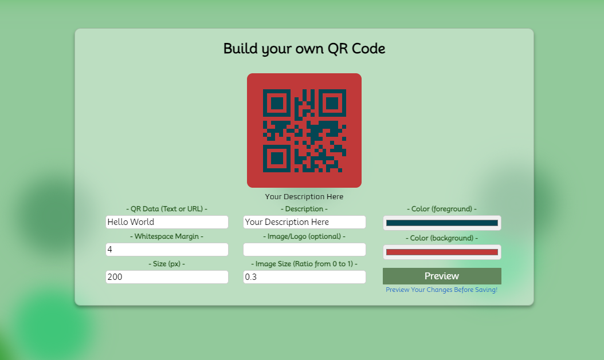

# QReator 
## https://qreator-frontend.onrender.com/ (live demo)



This website provides users with a streamlined and easy-to-use method for customizing, saving, downloading, and editing their own QR Codes. The content of the QR Codes can be any URL or string. Users also have the ability to overlay an image of their choice, making this a perfect tool for personal branding/marketing.

## The Tech Stack:
- JavaScript
- React.js
- Node.js
- HTML
- CSS
- PostgreSQL

## API Endpoints:

QR Code Generation: 
https://quickchart.io/qr?

Single endpoint relies on series of query string parameters to determine product.

### Parameters:

- Text: Content of the QR Code (can be a URL or any other string)
- Margin: Whitespace around the QR Code
- Size: Dimensions of QR Code
- Dark: Hex Color code for the (normally) black QR grid cells
- Light: Hex Color code for the (normally) white QR grid cells
- Center Image URL: URL of image to show in center (URL Encoded)
- Center Image Size Ratio: How much space the image takes up

## User Flow:

Upon first visiting the website, users are greeted with a straightforward and user-friendly interface. The journey typically begins with the following options:

    Log In: Existing users can access their accounts by entering their credentials, consisting of a username and password.

    Sign Up: New users can create an account by providing essential information such as a username, password, first name, last name, and email address.

After creating or logging into their account, users are welcomed with a friendly message and presented with the option to "Start Qreating."

Clicking the "Start Qreating" button guides users to a code creation form, where they have the creative freedom to customize their QR codes according to their preferences.

As users interact with the code creation form, they can preview the QR code in real-time, ensuring that it meets their expectations. They have the flexibility to make any adjustments necessary to achieve their desired outcome.

Once satisfied with their QR code design, users have the option to save it to their personal library. Saving the QR code allows users to store it for future reference, edits, and downloads. This library feature makes it convenient for users to manage and access their QR codes efficiently.

In summary, Qreator offers a seamless and intuitive user experience, allowing users to create, customize, and save their QR codes with ease. Whether they're using it for personal or professional purposes, this platform provides the tools they need to make the most out of QR code technology.

## Testing:

In this project, testing is an essential part of ensuring the reliability and correctness of the components and routes. All test files are denoted with the `.test.js` suffix, and they are located in the same directory as their respective code. To run the tests and ensure everything is working as expected, you can use the following command for both the front-end and back-end:

```bash```
npm test

## Available Scripts

In the project directory, you can run:

### `npm start`

Runs the app in the development mode.\
Open [http://localhost:3000](http://localhost:3000) to view it in your browser.

The page will reload when you make changes.\
You may also see any lint errors in the console.

### `npm test`

Launches the test runner in the interactive watch mode.\
See the section about [running tests](https://facebook.github.io/create-react-app/docs/running-tests) for more information.

### `npm run build`

Builds the app for production to the `build` folder.\
It correctly bundles React in production mode and optimizes the build for the best performance.

The build is minified and the filenames include the hashes.\
Your app is ready to be deployed!

See the section about [deployment](https://facebook.github.io/create-react-app/docs/deployment) for more information.

### `npm run eject`

**Note: this is a one-way operation. Once you `eject`, you can't go back!**

If you aren't satisfied with the build tool and configuration choices, you can `eject` at any time. This command will remove the single build dependency from your project.

Instead, it will copy all the configuration files and the transitive dependencies (webpack, Babel, ESLint, etc) right into your project so you have full control over them. All of the commands except `eject` will still work, but they will point to the copied scripts so you can tweak them. At this point you're on your own.

You don't have to ever use `eject`. The curated feature set is suitable for small and middle deployments, and you shouldn't feel obligated to use this feature. However we understand that this tool wouldn't be useful if you couldn't customize it when you are ready for it.